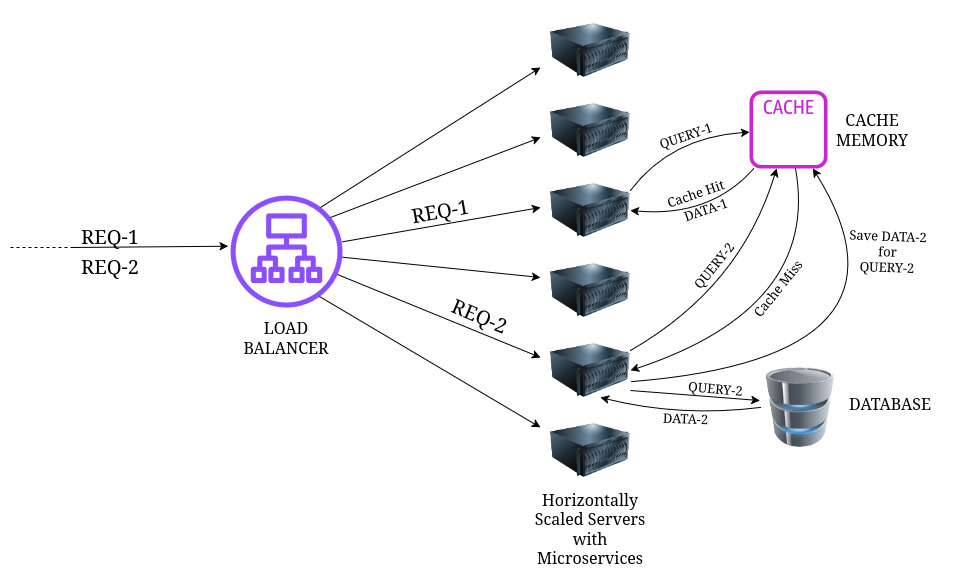

# **SYSTEM ARCHITECTURE & SCALING STRATEGY**

> This document outlines the architectural decisions for the **Echoscape API** backend and addresses the core requirements for scaling, cost optimization, caching and security.

---

## **1. How would you scale this to 100K users?**
> To handle 100K active users, the system will need to be transformed to a horizontally scaled microservices architecture with load balancers implementation.
> ### 1.1. Why microservices?
> In monolithic architecture, the entire application needs to be scaled together. Saving a journal text (fast, I/O bound) and waiting for an LLM to analyze that text (slow, compute/network bound) have vastly different resource requirements. By migrating to microservices, we can decouple these different service domains and group similar domains together. For example, we can have a separate service for LLM analysis, a separate service for database operations, and a separate service for user authentication. This allows us to scale each service independently based on its specific needs. Hence microservices architecture is preferred for large scale applications.
> ### 1.2. Why load balancers?
> As the number of users increases, the number of requests to the server will also increase. A single server will not be able to handle all the requests, this implies that the number of server instances also needs to be increased. Here comes the need of a load balancer. A load balancer (like AWS ALB or Nginx) handles the heavy HTTP traffic by forwarding the traffic to the nearest server or the server with the least load for faster response. It uses algorithms like Round Robin or Least Connections to route user requests to the server with the most available capacity. More importantly, it continuously performs "Health Checks" on our servers; if one Node.js instance crashes, the load balancer instantly reroutes traffic away from it, eliminating Single Points of Failure (SPOF). This way a load balancer ensures that no single server is overloaded, the application remains responsive even under heavy load and crashed servers are automatically removed from the pool.
> ### 1.3. Why horizontal scaling, but not vertical scaling?
> Server scaling is a very effective way to scale an application. It is a process of increasing the capacity of a server either by adding more resources, such as CPU, RAM, etc. to it (Vertical Scaling) or by increasing the number of servers (Horizontal Scaling). Vertical scaling is not a cost effective way to scale an application and is also limited by the maximum capacity of a server. Cost of the components increase exponentially with their performance/capacity. On the other hand, horizontal scaling is a cost effective way to scale an application and is not limited by the maximum capacity of a server. It is also more fault tolerant than vertical scaling because if one server fails, the other servers can still handle the load. Moreover, horizontal scaling allows us to scale different components of the application independently based on their specific needs. This approach provides infinite elasticity (we can easily add 10 more servers during a traffic spike and remove them when traffic dies down) and vastly improves fault tolerance.
> ### 1.4. Database Scaling
> At 100K active users, a single MongoDB instance will face severe write-locks and degraded read performance. We would scale the database in two primary ways:
> + **Read/Write Splitting (Replica Sets):** We would route all `POST` requests (creating journals) to a Primary database node, and route all `GET` requests (loading dashboards) to Secondary Read Replicas. This instantly cuts the load on the primary server.
> + **Sharding:** As the total data volume grows into the terabytes, we would partition the database across multiple physical machines. By using a hashed userId as the shard key, we ensure that a specific user's journal history is always grouped on the same physical shard for lightning-fast retrieval.
> ### 1.5. Decoupling the LLM with Asynchronous Queues
> Synchronously waiting for the Gemini API to respond during a user's HTTP request will cause severe timeouts at scale. To fix this, we would implement a Message Broker (like Redis with BullMQ, or AWS SQS). When a user submits a journal, the API immediately saves the raw text, pushes an "Analyze Content" event to the queue, and responds to the user instantly (`202 Accepted`). A background worker then picks up the job, calls Gemini, and updates the database asynchronously.

---
---

## **2. How would you reduce LLM cost?**
> ### 2.1. Prompt Optimization & Token Minimization
> LLM APIs charge per token. The most immediate cost-saving measure is reducing the size of the input and enforcing concise output.
> + **Strict System Instructions:** The prompt will be optimized to explicitly forbid the LLM from generating conversational filler (e.g., "Here is your analysis...").
> + **JSON Schema Enforcement:** By utilizing structured output formats (forcing the model to return a strict and minimal JSON object), we drastically reduce output tokens.
> + **Context Truncation:** If a user submits a massive 5000-word journal entry, we will implement a backend pre-processor to truncate or summarize the text to a maximum token limit before sending it to the Gemini API, ensuring a predictable maximum cost per request.
> ### 2.2 Intelligent Caching Layer (Frequency Reduction)
> It is unnecessary to use an LLM to analyze the exact same thought twice.We will introduce a Redis caching layer. Before hitting the Gemini API, the backend will check if the user's journal text is already present in the cache Redis. If that exact text exists in Redis, we immediately return the cached JSON analysis, completely bypassing the LLM API.
> ### 2.3. Batch Processing (Compute Optimization)
> Instead of sending one API request per journal entry, background workers can aggregate 10–20 journal entries from different users into a single, structured prompt. The LLM processes them all at once and returns a mapped JSON array. This maximizes the API throughput and heavily reduces network latency overhead.
> ### 2.4. Rate Limiting & Client-Side Throttling (Endpoint Protection)
> Malicious users or frontend bugs could accidentally spam the API, draining the quota in minutes.
> + **API Gateway Limit:** We will implement strict rate limiting via an API Gateway or Express middleware (e.g. `express-rate-limit`), restricting users to a maximum number of AI analysis per hour.
> + **Debouncing:** The frontend will implement debouncing on submission buttons and autosave features to ensure we only send the final, complete text to the backend, rather than triggering the AI on every keystroke.

---
---

## **3. How would you cache repeated analysis?**
> The Insights dashboard relies on MongoDB Aggregation Pipelines to calculate total entries, top emotions, and tag clouds. While powerful, aggregations require the database to scan, group, and sort multiple documents. If 100,000 users refresh their dashboard simultaneously, it would cause massive CPU spikes and I/O bottlenecks on the database cluster. To solve this, we would introduce an in-memory caching layer using **Redis**.
> ### 3.1. The Read-Through Cache Pattern
> Instead of querying MongoDB every time the Insights endpoint is hit, the Express controller will implement a Read-Through cache pattern:
> + **Intercept:** When a `GET /insights/:userId` request arrives, the server first checks Redis for a key matching `insights:{userId}`.
> + **Cache Hit:** If the data exists, Redis returns the pre-calculated JSON string in roughly ~1 millisecond. The server sends this to the client immediately, completely bypassing MongoDB.
> + **Cache Miss:** If the data does not exist, the server executes the heavy MongoDB aggregation, returns the data to the client, and simultaneously saves that exact JSON response into Redis under the `insights:{userId}` key for future requests.
> ### 3.2. Cache Invalidation (Event-Driven)
> The hardest part of caching is ensuring the user doesn't see outdated statistics. If a user writes a new journal entry, their "Total Entries" count on the dashboard needs to be updated immediately. We will handle this using Event-Driven Invalidation:
> + **The Trigger:** Whenever a user successfully hits the `POST /api/v1/journal` endpoint (creating a new entry), we hook into that successful database save.
> + **The Deletion:** The Express server will issue a `DEL insights:{userId}` command to Redis.
> + **The Result:** The next time the user navigates to their Insights tab, they will trigger a Cache Miss. The system will run a fresh MongoDB aggregation (including their newest entry), serve the accurate data, and re-cache the updated statistics.
> ### 3.3. Time-To-Live (TTL) Fallback
> As a failsafe to prevent Redis memory from filling up with data from inactive users, every cached insight object will be assigned a TTL (Time-To-Live) of 24 hours. If a user doesn't log in for a day, their cached dashboard data is automatically evicted from RAM, saving infrastructure costs.

---
---

## **4. How would you protect sensitive journal data?**
> Journal entries contain highly sensitive, personal, and psychological data. Protecting this information from unauthorized access and ensuring privacy when interacting with third-party LLMs is the highest priority of the system architecture.
> ### 4.1. Secure Session Management (Dual-Token Authentication)
> To maintain secure and long-lived user sessions without exposing the system to common web vulnerabilities, we implement a dual-token JWT (JSON Web Token) strategy:
> + **Access Token (Short-Lived):** A JWT with a short expiration (e.g., 15 minutes) is returned to the client and stored in the browser's memory or localStorage. It is sent via the Authorization: Bearer header. Even if compromised via an XSS attack, its short lifespan severely limits the attack window.
> + **Refresh Token (Long-Lived):** A secondary token (e.g., valid for 7 days) is generated and sent to the client as a strict HttpOnly, Secure, and SameSite=Strict cookie. This makes it completely invisible to JavaScript, neutralizing XSS threats. When the Access Token expires, the client hits a /refresh endpoint, automatically sending the secure cookie to obtain a new Access Token.
> + **Token Rotation & Revocation:** The server stores a hashed version of the active Refresh Token in the database. If a user logs out, or if suspicious activity is detected, the server deletes the token from the database, instantly revoking the session.

> ### 4.2. End-to-End Encryption (E2EE) for Journal Content
>To provide absolute privacy, we will implement an optional E2EE layer for the journal text itself:
> + **Client-Side Encryption:** Before a journal entry is saved to the MongoDB database, the Express middleware will encrypt the text using a symmetric key derived from the user's account credentials (e.g., derived from their password hash or a dedicated encryption key stored securely).
> + **Database Storage:** The database will store the encrypted ciphertext, not the plain text. Even if a malicious actor gains direct access to the MongoDB cluster, the journal content remains unreadable.
> + **Decryption on Read:** When the user requests to view their journal, the server retrieves the ciphertext, sends it to the client, and the client-side JavaScript decrypts it using the same derived key. This ensures that the sensitive data never resides in plain text on the server or in transit (beyond the initial encryption step).
> ### 4.3. Data Minimization & Anonymization
> + **No PII in Logs:** The backend will be configured to scrub or ignore personally identifiable information (PII) when generating logs or sending data to third-party analytics tools.
> + **Anonymized LLM Requests:** When sending journal entries to the Gemini API, we will strip any identifying metadata (like usernames or email addresses) from the payload. We will rely on the API key authentication to identify the source, not the data content.

---